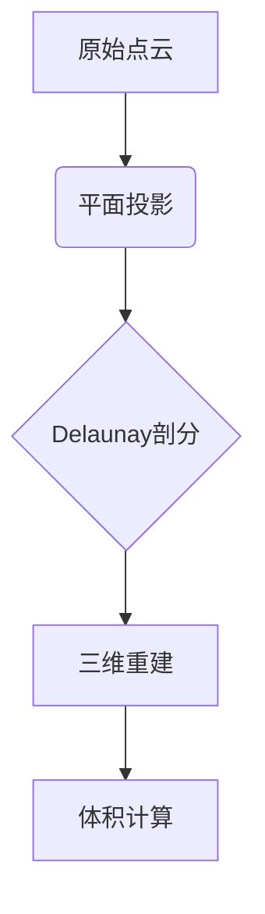

```markdown
# DTM批量验证工具

本项目旨在无法采用AutoCAD和南方CASS专业级数字地形模型验证工具时采用，支持批量处理Excel测量数据，自动计算工程土方量并生成三维可视化报告。

如果需要需要精确度较高的软件，需要聘请专业测绘师及购买相关软件如AutoCAD和南方CASS进行使用

## 📥 快速开始

### 环境要求
- Python 3.8+
- 必需库：`pandas numpy scipy matplotlib`

```bash
pip install -r requirements.txt
```

## 🚀 功能特性

| 模块         | 功能描述                                                                 |
|--------------|--------------------------------------------------------------------------|
| 批量处理     | 支持文件夹递归扫描，自动识别.xlsx文件                                    |
| 三维可视化   | 动态生成可旋转的3D模型，标注每个三角面的面积/体积                        |
| 智能校验     | 自动检测数据异常（空值/非数值/数据不足），记录错误日志                  |
| 报告系统     | 生成包含16项关键指标的Excel统计报告                                      |

## 🧩 输入规范
```plaintext
1. Excel文件无表头
2. 列顺序强制要求：
   [点名称, X坐标, Y坐标, Z高程]
3. 单位：米（浮点数）
```

## 📊 输出样例
```python
示例输出文件结构：
output/
├── projectA_3d.png    # 三维可视化图（300dpi）
└── 处理报告_20230815.xlsx  # 包含：
                          ▪ 总体积计算

                          ▪ 高程极值统计

                          ▪ 模型复杂度分析

```

## 🛠️ 核心算法

### Delaunay三角剖分


体积计算公式：
```
V = Σ(三角形投影面积 × 平均高差)
```

## 📜 许可证
本项目采用 [MIT License](LICENSE)，允许商业用途，但需保留版权声明。

---

**开发者提示**：使用`plotly`分支可获得交互式3D可视化功能（需额外安装plotly库）
```